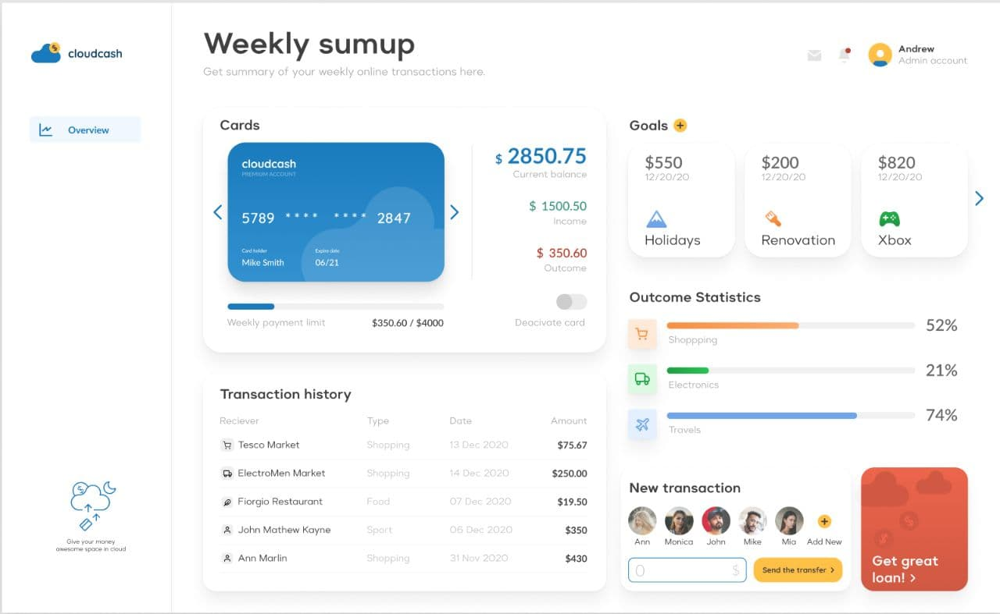

# GSI-Dashboard

This is a practical exercise that must be done in order to complete the aplication process to [GSoft Innovation](https://www.gsoftinnovation.com/) company. The goal was to reproduce the next dashboard:

The main objective was to demonstrate great CSS skills, thats why this Dashboard was built without using any components library. Only an npm package was installed in order to use the carousel component.

Nuxt framework was used to as a frontend framework 